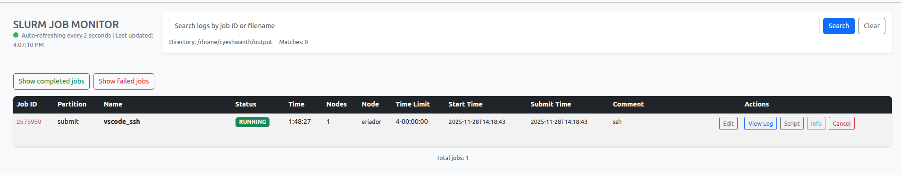

# slurman: Simple Web Slurm Monitor

A Flask + Vue.js web application to monitor Slurm jobs in real-time. Built with Cursor.


 
## Features

- Real-time polling of Slurm jobs every 2 seconds
- Beautiful Bootstrap-styled table interface
- Status badges with color coding
- Cancel button to stop running/pending jobs
- Inline per-job comments stored locally in `comments.json`
- Global search to open logs from past jobs by job ID or filename
- Collapsible panels for logs (with chunked/virtualized viewer), batch scripts, and detailed job info
- Auto-refreshing log viewer that streams more content as you scroll
- Auto-refresh indicator
- Responsive design

## Setup

1. Install dependencies:
```bash
pip install -r requirements.txt
```

2. Configure your Slurm username in `config.yaml`:
```yaml
slurm_username: <slurm_username>
poll_interval: 2
log_dir: <slurm log dir>
```

3. Run the Flask server (set `PORT` to override the default `5000` if needed):
```bash
# export PORT=8080
python app.py
```

4. Open your browser and navigate to `http://localhost:${PORT:-5000}/`

## Viewing Logs

- Click **View Log** next to any job to open the tail of the log file from `log_dir`. Only a ~200 KB chunk is fetched initially to keep the UI responsive; as you scroll toward the top/bottom the viewer automatically loads adjacent chunks (up to ~1 MB each).
- The log panel refreshes every 2 seconds automatically; use **Hide Log** to stop streaming and polling.
- If no log file containing the job ID is found, the panel shows a warning message.

## Searching Historical Logs

- Use the search box at the top to locate logs by job ID or any substring of the filename.
- Matching files are listed with size and timestamp; click **Open log** to preview the contents in a collapsible panel.
- When the search returns a single result, the log opens automatically. The historical viewer uses the same chunked loading (auto-fetches more content as you scroll).

## Scripts & Job Info

- Use the **Script** button to view the original batch script (`scontrol write batch_script`) used to start the job.
- Use the **Info** button to view `scontrol show jobid -dd` output with all related metadata.
- Both panels are collapsible and refresh on demand; only one panel of each type is visible at a time.

## Job Comments

- Use **Add/Edit Comment** to attach lightweight notes to each job.
- Comments are saved to `comments.json` in the project root so they persist between refreshes.
- The textbox supports multi-line text; comments show inline in the jobs table for quick reference.

## API Endpoints

- `GET /api/jobs` - Returns list of Slurm jobs for the configured user
- `GET /api/jobs/<job_id>/log` - Returns a chunk of the log file (supports `start`/`length` query args)
- `GET /api/jobs/<job_id>/script` - Returns the batch script used to submit the job
- `GET /api/jobs/<job_id>/info` - Returns `scontrol` metadata for the job
- `GET /api/jobs/<job_id>/comment` - Fetch the saved comment for a job
- `POST /api/jobs/<job_id>/comment` - Update the saved comment for a job
- `GET /api/logs/search` - Search historical log files by query string
- `GET /api/logs/view` - Fetch a chunk of a log by relative path within `log_dir`
- `GET /api/health` - Health check endpoint

## Configuration

Edit `config.yaml` to change:
- `slurm_username`: Your Slurm username
- `poll_interval`: Polling interval in seconds (currently handled by frontend)
- `log_dir`: Directory where Slurm log files are stored (used for search + viewer)

